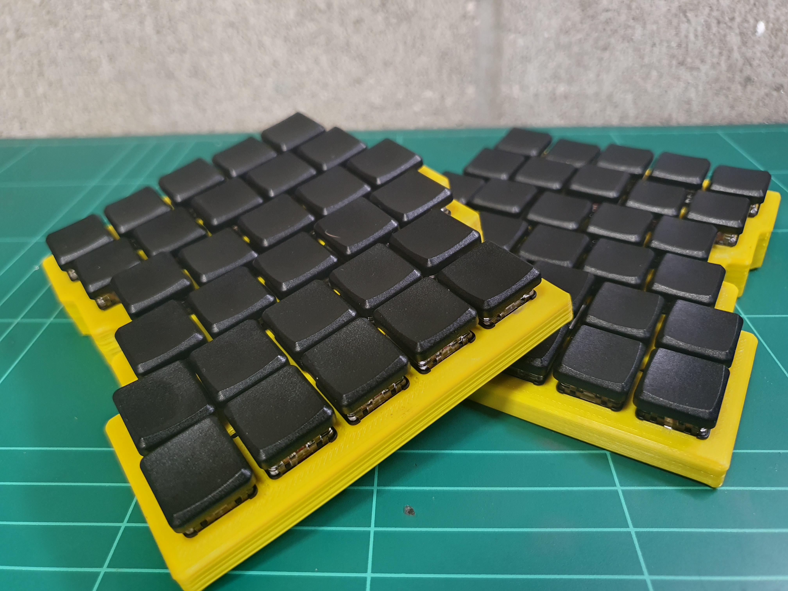
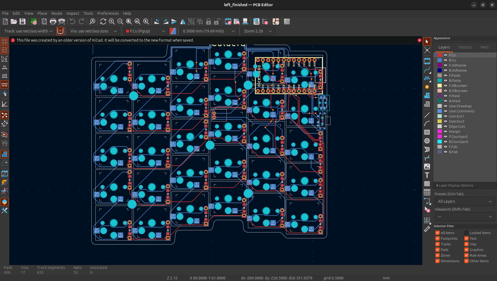
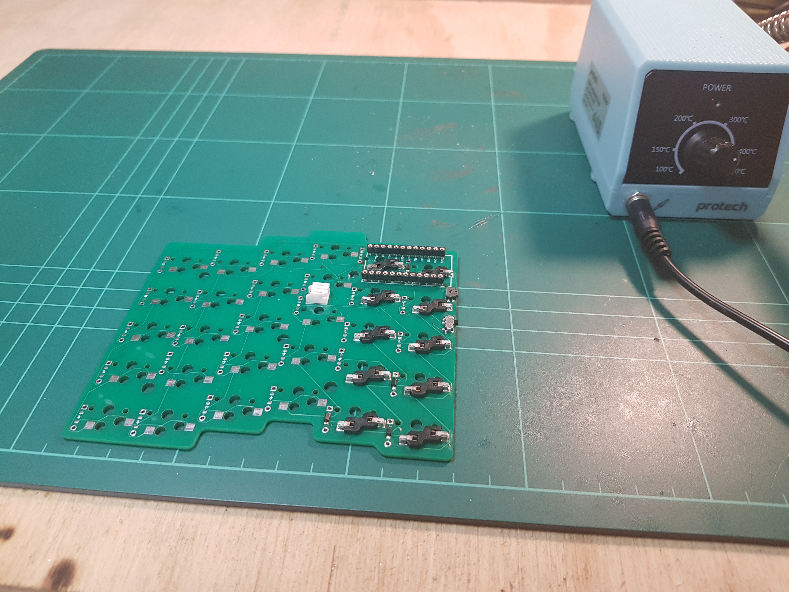
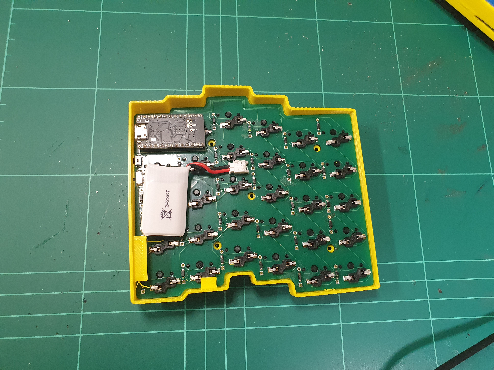

# Custom Split Ergonomic Keyboard

## Overview
This custom keyboard was designed and built from the ground up as a personal project to explore hardware development and embedded systems programming. The project demonstrates skills in PCB design, physical prototyping, and problem solving while creating a practical, daily-use device optimized for ergonomics and productivity.

## Technical Details
### Hardware
- Microcontroller: Nice!Nano
- Case: 3D printed
- Switches: Kailh Low Profile Choc Switches - Red
- Interconnect: Bluetooth connection between halves

### Firmware
The keyboard runs on ZMK firmware, allowing for:
- Multiple layers of key mappings
- Bluetooth device swapping

## Build Process
First I needed to research, and buy the necessary parts

I then soldered: 
- The diodes and hot-swap sockets to the board row by row to avoid interferance
- Machine sockets, reset button, power swicth and power jack to the board
- The Mill-Max pins to the microcontroller

## Challenges and Solutions
Reversed Diodes:
- Challenge: I found out why people reccomend using magnifying lenses, I had found that some diodes were reversed when I was not careful about the orientation of the diodes. [Video showing diodes were reversed](https://youtu.be/mBb5se6Coak)
- Solution: Since I only had a small hand held magnifying glass which would have not been practicle to use while soldering; I decided to paint the left side of the diodes while they were still in the packaging and double checked that the orientations were the same for all of them with my magnifying glass, so that I can proceed to solder the diodes for the second half without issue.

Mismatched Battery Connection:
- Challenge: While trying to find a reputable source of batteries that shipped to New Zealand and also met the specific requirements noted in the Nice!Nano docs. I had negletced that there are multiple types of JST connections. 
- Solution: To resolve the issue that my battery would not connect to my board, I carefully cut the wires making sure they do not touch, crimped on JST ph connecters, and was able to use the batteries.

Bluetooth Connectivity Issue:
- Challenge: For some reason the bluetooth was only able to connect to some devices and even then it was not consistant.
- Solution: While a wireless keyboard could have been useful in specific circumstances, it was a nice to have from the start and not necessary, so was not pursued further.

## Future Improvements
- Replace prototype case with a more refined 3D printed or wooden case
- Improved ergonomics by including tenting feet
- Wireless connectivity using Bluetooth

## Skills Demonstrated
- Electrical engineering fundamentals
- CAD modeling
- Physical prototyping and fabrication
- Problem-solving and debugging
- Human-computer interaction principles

